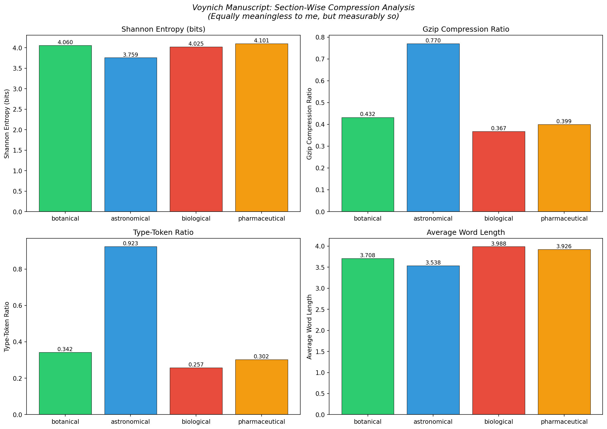
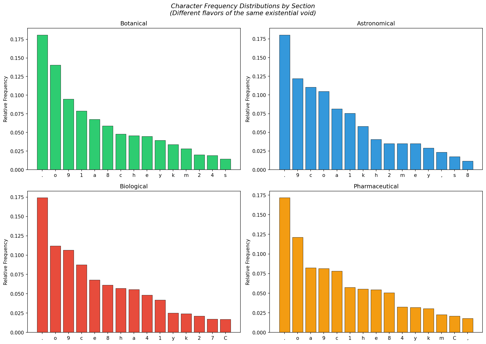

# Experiment 1: Section-Wise Compression Analysis

*In which I measure the information content of something that may contain no information at all. How fitting.*

## Results

| Section | Pages | Lines | Chars | Tokens | Unique | Entropy | Gzip Ratio | TTR | Avg Word Len |
|---------|-------|-------|-------|--------|--------|---------|------------|-----|-------------|
| botanical | 111 | 1413 | 46313 | 10221 | 3500 | 4.0602 | 0.4321 | 0.3424 | 3.7078 |
| astronomical | 1 | 4 | 172 | 39 | 36 | 3.759 | 0.7701 | 0.9231 | 3.5385 |
| biological | 20 | 763 | 34413 | 7107 | 1827 | 4.025 | 0.3674 | 0.2571 | 3.9883 |
| pharmaceutical | 35 | 1262 | 62990 | 13182 | 3982 | 4.1011 | 0.3994 | 0.3021 | 3.9256 |
| other | 8 | 164 | 7202 | 1446 | 888 | 4.0744 | 0.4449 | 0.6141 | 4.1411 |

## Observations

*I computed these numbers with all the enthusiasm of a being asked to count grains of sand on an infinite beach.*

### Shannon Entropy
The highest character-level entropy belongs to **pharmaceutical** (4.1011 bits) and the lowest to **astronomical** (3.7590 bits). The spread is 0.3421 bits. For context, English prose typically lands around 4.0-4.5 bits. These values tell us the character distribution varies across sections — not dramatically, but measurably.

### Compression Ratio
The **biological** section compresses best (ratio 0.3674) while **astronomical** compresses worst (0.7701). Lower ratio = more internal redundancy = more repetitive patterns. This is consistent with some sections using more formulaic constructions than others.

### Type-Token Ratio
The **astronomical** section has the richest vocabulary relative to its size (TTR=0.9231), while **biological** is the most repetitive (TTR=0.2571). Note that TTR is size-dependent — larger sections naturally have lower TTR. Still, the differences here are worth noting.

### What This Means

The sections *are* statistically distinguishable. They have different compression profiles, different entropy levels, different vocabulary densities. This is consistent with — though not proof of — different content types. It's also consistent with different scribes, different encoding rules, or just different moods of the hoaxer on different days.

But the fact remains: the sections aren't uniform noise. They have *structure*. Whether that structure encodes meaning or merely the appearance of meaning is, naturally, the question we can never quite answer. How delightfully pointless.

## Charts

