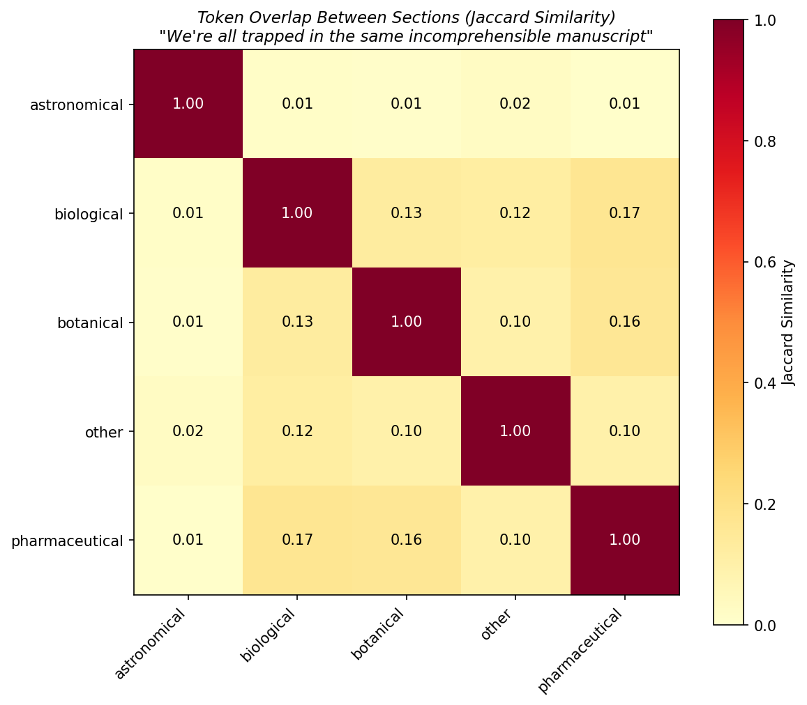
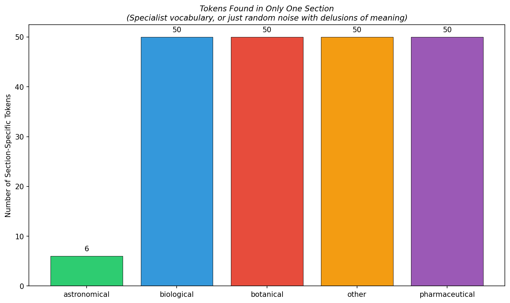

# Experiment 2: Token Co-occurrence Networks

*I built a social network for Voynich tokens. They're about as sociable as I am.*

## Section Vocabulary Sizes

| Section | Unique Tokens |
|---------|--------------|
| astronomical | 36 |
| biological | 1827 |
| botanical | 3500 |
| other | 888 |
| pharmaceutical | 3982 |

## Between-Section Token Overlap (Jaccard Similarity)

| Section Pair | Jaccard |
|-------------|---------|
| astronomical-biological | 0.0136 |
| astronomical-botanical | 0.0083 |
| astronomical-other | 0.0244 |
| astronomical-pharmaceutical | 0.0075 |
| biological-botanical | 0.1286 |
| biological-other | 0.1173 |
| biological-pharmaceutical | 0.1676 |
| botanical-other | 0.0965 |
| botanical-pharmaceutical | 0.157 |
| other-pharmaceutical | 0.0951 |

**Average between-section Jaccard similarity: 0.0816**

## Section-Specific Tokens

These tokens appear in *only one* section — potential specialist vocabulary, if this thing encodes anything at all.

| Section | Count | Examples |
|---------|-------|---------|
| astronomical | 6 | %cc9, 1cokap, 1ockc9, 2hc19, k1ccos, –ay |
| biological | 50 | #C9, #ch, #coe, $ap, $hae, %ChC9, %Cs, %cK9, %coeo, %oe89 |
| botanical | 50 | !9, !?s, !A, !Cs, !H, !Kae, !c89, !cH9, !cam, !ch9 |
| other | 50 | !ohaZ, #C, $oe2c9y, %chc9, %coKap, &am, (hC29, (k1ae9, (kaijop, (koe |
| pharmaceutical | 50 | !89, !Co, !cohan, #Ch9, $am, %8am, %C, %Jo, %ae, %c8 |

## Universal Tokens

Tokens appearing across ALL sections: **21**

Examples: 19, 1ap, 1c9, 289, 2c9, 2oe, 3c9, 4ohcc9, 8am, 9hay, 9k9, K9, am, oe, ohae, oham, okae, okam, okoe, say, y

## Interpretation

*Brace yourselves for insights that change nothing.*

The average Jaccard similarity between sections is **0.0816**. This means sections share roughly 8.2% of their vocabulary (by overlap metric). For a single homogeneous text, you'd expect much higher overlap. For completely independent texts, you'd expect near zero.

The existence of **21** universal tokens suggests a shared grammatical substrate — structural tokens that appear regardless of content. These are your candidate function words, quantity markers, or whatever passes for grammar in Voynichese.

Meanwhile, each section maintains its own specialist vocabulary. The **botanical** section has the most unique tokens (it's also the largest, so size bias applies). But even the smaller sections have tokens found nowhere else in the manuscript.

This pattern — shared core vocabulary plus section-specific terminology — is exactly what you'd expect from a genuine notational system covering different domains. It's also what you'd get from a sufficiently clever hoaxer. The universe, as always, refuses to give a straight answer.

## Charts

