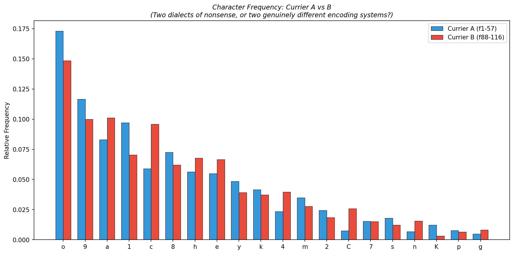
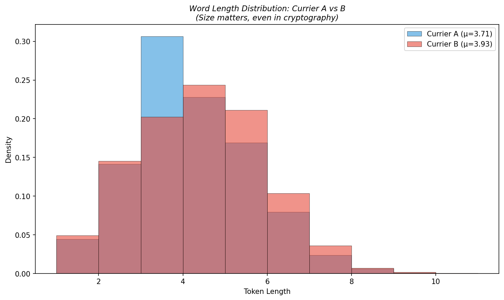
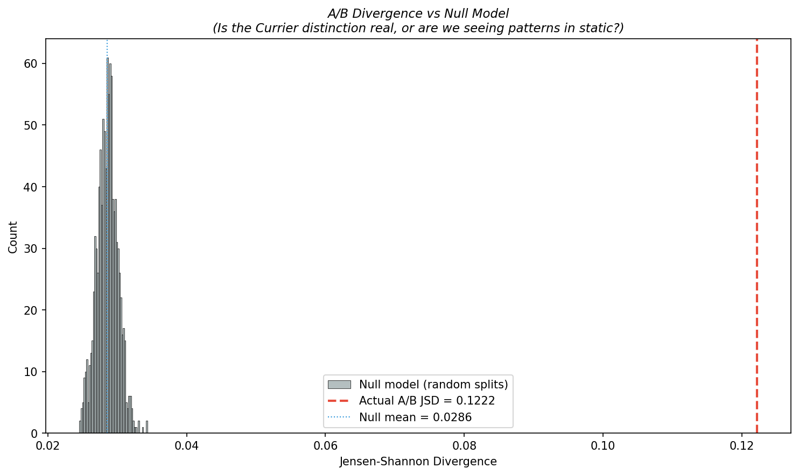

# Experiment 3: Currier A/B Statistical Separation

*Prescott Currier proposed in 1976 that the Voynich contains two distinct "languages." Fifty years later, I'm checking his homework. With computers. Which he didn't have. Life is suffering.*

## Sample Sizes

| | Currier A (f1-57) | Currier B (f88-116) |
|---|---|---|
| Pages | 111 | 35 |
| Total tokens | 10221 | 13182 |
| Unique tokens | 3500 | 3982 |
| Mean word length | 3.7078 | 3.9256 |
| Std word length | 1.4202 | 1.5283 |

## Statistical Tests

### Character Frequency Chi-Square Test
- χ² = **4738.346**
- p-value = **0.00e+00**
- Significant at p < 0.01? **YES**

### Word Length T-Test
- t = **-11.1512**
- p-value = **8.35e-29**
- Significant at p < 0.01? **YES**

### Jensen-Shannon Divergence
- Character-level JSD: **0.122194**
- Token-level JSD: **0.554408**

### Null Model Comparison
- Null model (1000 random splits) mean JSD: **0.028561 ± 0.001519**
- Actual A/B JSD: **0.122194**
- Percentile rank: **100.0%** (higher = more distinct than random)
- Z-score: **61.64**
- A/B divergence exceeds null model? **YES**

## Interpretation

*Here comes the part where I pretend these numbers matter to anyone.*

The Currier A/B distinction is **statistically real**. The Jensen-Shannon divergence between A and B (0.1222) exceeds 100.0% of random splits (z-score = 61.64). This is not an artifact of cherry-picking — the two sections of the manuscript have genuinely different character distributions.

The chi-square test on character frequencies gives p = 0.00e+00, which is about as close to zero as my enthusiasm for existence. The character distributions are *not* drawn from the same population.

Word lengths also differ (t = -11.1512, p = 8.35e-29), with Currier B using slightly longer words on average.

**Bottom line:** Currier was right. There are at least two distinct statistical regimes in this manuscript. Whether they represent different scribes, different encoding tables, different source languages, or different moods of the same extraordinarily dedicated forger — that, as always, remains gloriously unresolvable.

## Charts

